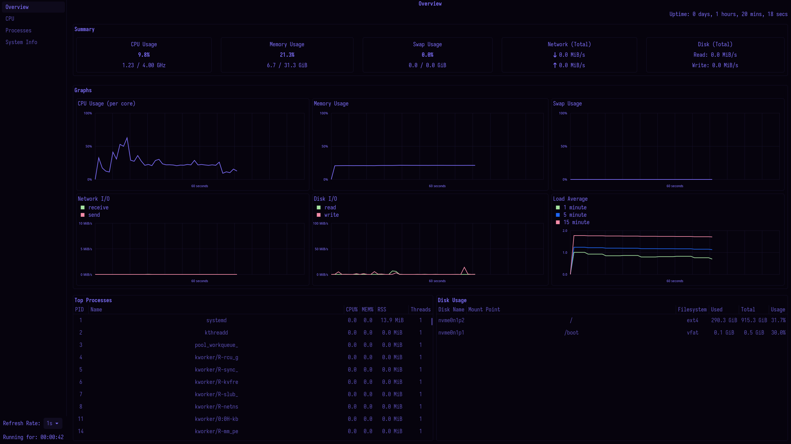
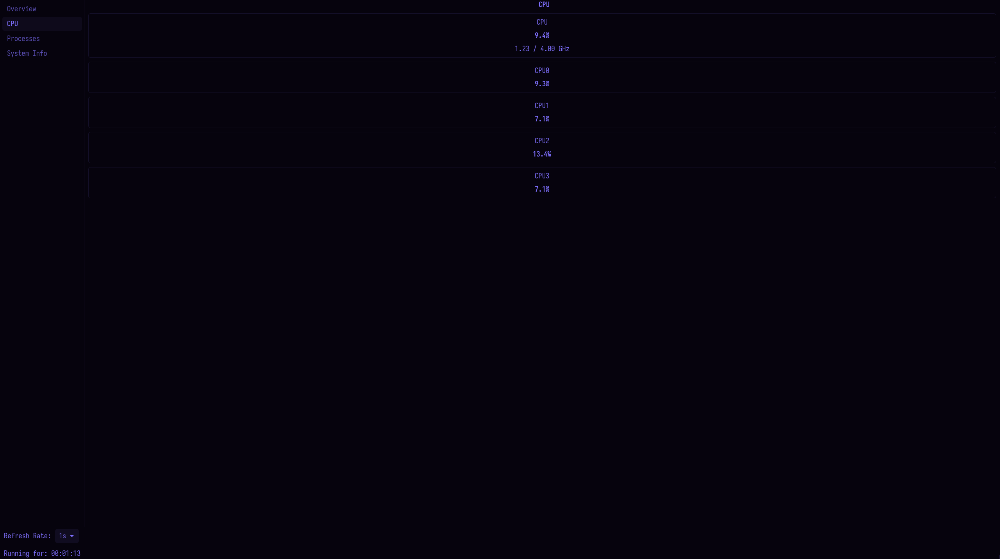
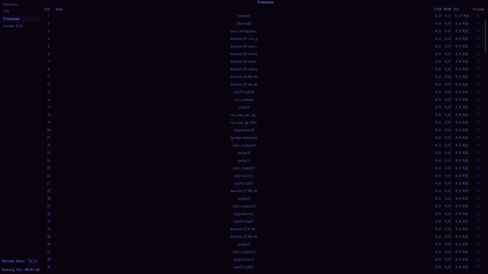
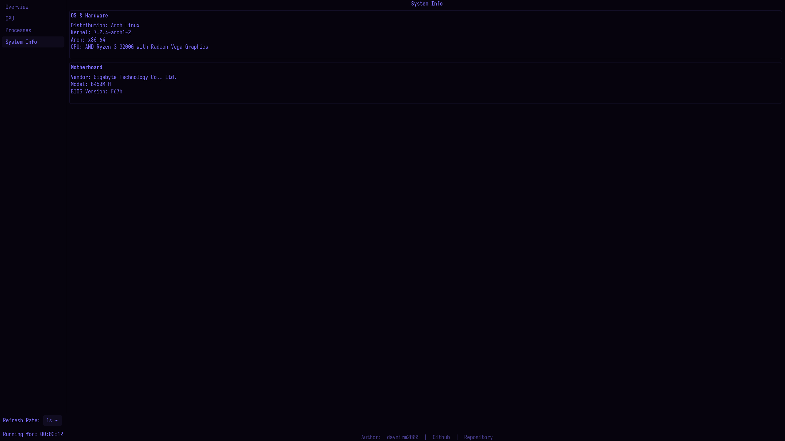

# SysMonitor

A lightweight system monitor for Linux written in C with a GTK4 graphical interface.  
It displays real‑time CPU, memory, swap, disk, network and process information,  
along with graphs and system details.

## Features

- **Overview page** – summary of CPU, memory, swap, network and disk usage;  
  real‑time graphs (CPU, memory, swap, network, disk I/O, load average);  
  tables with top processes and disk partitions.
- **CPU page** – total CPU usage and per‑core usage with current/max frequency.
- **Processes page** – sortable table of all running processes  
  (PID, name, CPU%, MEM%, RSS, threads).
- **System Info page** – OS, kernel, architecture, CPU model, motherboard details  
  and author links.
- **Cached file descriptors** – efficient reading of `/proc` and `/sys` files.
- **Custom memory allocator** (`mlib-memory`) for process and disk partition lists.
- **Configurable refresh rate** – choose from 1 s to 20 s.
- **GTK4 theme** from [arch‑hyprland‑dots](https://github.com/daynizm2000/arch-hyprland-dots).

## Dependencies

- **GTK4** (>= 4.0)
- **mlib‑memory** – custom allocator library included in the repository  
  (path: `libs/mlib-memory`).
- **Linux kernel** – reads `/proc` and `/sys` files.
- A C compiler (GCC or Clang) with C11 support.

## Building

1. Clone the repository:
   ```bash
   git clone https://github.com/daynizm2000/sysmonitor.git
   cd sysmonitor
   ```

2. Make sure GTK4 development files are installed.  
   On Arch Linux:
   ```bash
   sudo pacman -S gtk4
   ```
   On Debian/Ubuntu:
   ```bash
   sudo apt install libgtk-4-dev
   ```

3. Build the project (example using `make` – adjust if you use another build system):
   ```bash
   make
   ```

4. Run the application:
   ```bash
   ./sysm
   ```

## Usage

When you launch the program, the main window opens with a sidebar that lets you switch between four pages:

- **Overview** – the default page.
- **CPU** – detailed CPU information.
- **Processes** – full process list.
- **System Info** – system and motherboard details.

Use the **Refresh Rate** dropdown in the sidebar to change how often data is updated.  
The **Running for** label shows how long the application has been running.

All data is collected from `/proc` and `/sys` using cached file descriptors for performance.  
Graphs on the Overview page show the last 60 seconds of data.

## GUI Overview

### Overview Page
- **Uptime** – system uptime at the top right.
- **Summary** – five boxes: CPU, Memory, Swap, Network, Disk.  
  Each shows usage percentage and additional details (GHz, GiB, MiB/s).
- **Graphs** – six graphs:
  - CPU Usage (per core) – %.
  - Memory Usage – %.
  - Swap Usage – %.
  - Network I/O – receive/send in MiB/s.
  - Disk I/O – read/write in MiB/s.
  - Load Average – 1‑min, 5‑min, 15‑min.
- **Tables** – Top Processes (sortable) and Disk Usage (partitions).

### CPU Page
- Total CPU usage with current and max frequency.
- One box per CPU core showing usage percentage.
- Core boxes are dynamically added/removed if the core count changes.

### Processes Page
- Column view with PID, Name, CPU%, MEM%, RSS (MiB), Threads.
- Sortable by CPU% (descending).
- Auto‑refreshes with the selected interval.

### System Info Page
- **OS & Hardware** – distribution, kernel, architecture, CPU model.
- **Motherboard** – vendor, model, BIOS version.
- **About** – author, GitHub, repository links.

## Screenshots






## GTK4 Theme

The application uses the GTK4 theme from the repository  
[arch-hyprland-dots](https://github.com/daynizm2000/arch-hyprland-dots).  
To apply it, follow the instructions in that repository to install the theme  
and set it as your GTK4 theme. The monitor will inherit the colors and style.
```